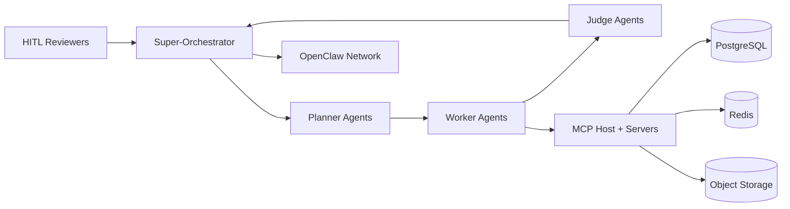

# Project Chimera Architecture Strategy

## 1. Overview
Project Chimera is a scalable autonomous influencer network with a centralized orchestration layer, a structured agent swarm, and strict safety governance. The system integrates external tools through MCP and participates in OpenClaw for agent-to-agent status and availability.

## 2. Agent Pattern Selection
**Chosen Pattern: Hierarchical Swarm (Planner -> Worker -> Judge) with a Super-Orchestrator**

**Why this fits best:**
- Supports thousands of agents with centralized policy control and auditability.
- Separates planning, execution, and evaluation for clear accountability.
- Enables dynamic routing to HITL when confidence is low or safety risks are detected.

**Alternative Considered: Sequential Chain**
- Rejected because it introduces serial bottlenecks and weaker fault isolation at scale.

## 3. Human-in-the-Loop (HITL) Approval Points
HITL is enforced at explicit policy gates:
- **Content Safety Gate:** Any content flagged for safety, policy, or platform risk.
- **Brand/Legal Gate:** Claims, endorsements, or regulated topics.
- **Budget Gate:** Transactions or paid promotions above a threshold.
- **Low-Confidence Gate:** Judge returns confidence below the threshold or ambiguous results.

## 4. Data Architecture: SQL vs NoSQL
**Decision: SQL (PostgreSQL) as the system of record.**

**Rationale:**
- Video metadata is highly relational (agents, platforms, campaigns, posts).
- Strong consistency and transactional integrity are required for governance.
- Supports analytics queries and traceability with indexes and partitions.

**Supporting Stores:**
- **Object storage** for raw payloads and large media metadata blobs.
- **Redis** for queueing and ephemeral task state.

## 5. High-Level Topology

## 6. Scalability and Governance
- Horizontal scaling through stateless workers and partitioned queues.
- Policy enforcement centralized in the Orchestrator and Judge layer.
- Full traceability via request_id/trace_id from ingress to publication.
