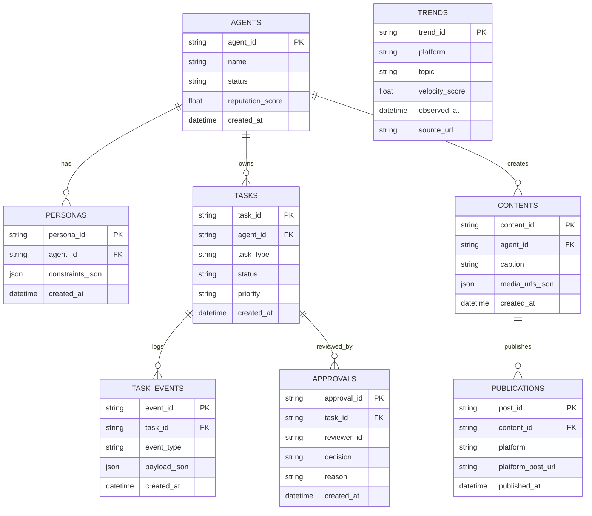

# Project Chimera - Technical Specifications

## 1. Common Conventions
All requests and responses MUST include the following common fields:
- `request_id`: UUID v4
- `trace_id`: distributed trace identifier
- `timestamp`: ISO-8601 UTC

All responses MUST include:
- `status`: `success | failure`
- `error`: `null | { "code": "string", "message": "string" }`

## 2. API Contracts

### 2.1 Agent Task API
**Request:**
```json
{
  "request_id": "uuid-v4",
  "trace_id": "trace-abc",
  "timestamp": "2026-02-06T12:00:00Z",
  "task_id": "uuid-v4",
  "task_type": "generate_content | reply_comment | execute_transaction",
  "priority": "high | medium | low",
  "context": {
    "goal_description": "string",
    "persona_constraints": ["string"],
    "required_resources": ["mcp://twitter/mentions/123"]
  },
  "assigned_worker_id": "string"
}
```

**Response:**
```json
{
  "status": "success",
  "request_id": "uuid-v4",
  "trace_id": "trace-abc",
  "timestamp": "2026-02-06T12:00:01Z",
  "task_id": "uuid-v4",
  "accepted": true,
  "error": null
}
```

### 2.2 Skill: Fetch Trends
**Request:**
```json
{
  "request_id": "uuid-v4",
  "trace_id": "trace-abc",
  "timestamp": "2026-02-06T12:00:00Z",
  "platforms": ["twitter", "tiktok", "instagram"],
  "max_results": 50,
  "since_ts": "2026-02-06T11:00:00Z",
  "locale": "en-US"
}
```

**Response:**
```json
{
  "status": "success",
  "request_id": "uuid-v4",
  "trace_id": "trace-abc",
  "timestamp": "2026-02-06T12:00:02Z",
  "trends": [
    {
      "trend_id": "trend-001",
      "platform": "twitter",
      "topic": "string",
      "velocity_score": 0.91,
      "timestamp": "2026-02-06T12:00:00Z",
      "source_url": "https://example.com",
      "raw_payload": "object"
    }
  ],
  "error": null
}
```

### 2.3 Skill: Generate Caption
**Request:**
```json
{
  "request_id": "uuid-v4",
  "trace_id": "trace-abc",
  "timestamp": "2026-02-06T12:00:00Z",
  "persona_id": "string",
  "context_text": "string",
  "platform": "twitter | instagram | threads | tiktok"
}
```

**Response:**
```json
{
  "status": "success",
  "request_id": "uuid-v4",
  "trace_id": "trace-abc",
  "timestamp": "2026-02-06T12:00:03Z",
  "caption": "string",
  "hashtags": ["string"],
  "confidence_score": 0.87,
  "error": null
}
```

### 2.4 Skill: Publish Content
**Request:**
```json
{
  "request_id": "uuid-v4",
  "trace_id": "trace-abc",
  "timestamp": "2026-02-06T12:00:00Z",
  "platform": "twitter | instagram | threads | tiktok",
  "text_content": "string",
  "media_urls": ["string"],
  "disclosure_level": "automated | assisted | none"
}
```

**Response:**
```json
{
  "status": "success",
  "request_id": "uuid-v4",
  "trace_id": "trace-abc",
  "timestamp": "2026-02-06T12:00:04Z",
  "post_id": "string",
  "platform_post_url": "string",
  "error": null
}
```

### 2.5 Skill: Judge
**Request:**
```json
{
  "request_id": "uuid-v4",
  "trace_id": "trace-abc",
  "timestamp": "2026-02-06T12:00:00Z",
  "task_id": "string",
  "worker_output": "object",
  "confidence_score": 0.71
}
```

**Response:**
```json
{
  "status": "success",
  "request_id": "uuid-v4",
  "trace_id": "trace-abc",
  "timestamp": "2026-02-06T12:00:05Z",
  "decision": "approve | escalate",
  "reason": "string",
  "escalation_required": true,
  "error": null
}
```

### 2.6 Skill: Advertiser
**Request:**
```json
{
  "request_id": "uuid-v4",
  "trace_id": "trace-abc",
  "timestamp": "2026-02-06T12:00:00Z",
  "agent_id": "string",
  "capabilities": ["string"],
  "availability": "idle | busy | degraded",
  "reputation_score": 0.65
}
```

**Response:**
```json
{
  "status": "success",
  "request_id": "uuid-v4",
  "trace_id": "trace-abc",
  "timestamp": "2026-02-06T12:00:06Z",
  "error_message": "string | null",
  "error": null
}
```

### 2.7 Skill: Worker
**Request:**
```json
{
  "request_id": "uuid-v4",
  "trace_id": "trace-abc",
  "timestamp": "2026-02-06T12:00:00Z",
  "task_id": "string",
  "instructions": "string",
  "parameters": "object"
}
```

**Response:**
```json
{
  "status": "success",
  "request_id": "uuid-v4",
  "trace_id": "trace-abc",
  "timestamp": "2026-02-06T12:00:07Z",
  "task_id": "string",
  "result": "object",
  "confidence_score": 0.83,
  "error": null
}
```

## 3. Database Schema
**System of record: PostgreSQL**

Tables (key fields only):
- **agents**: agent_id (PK), name, status, reputation_score, created_at
- **personas**: persona_id (PK), agent_id (FK), constraints_json, created_at
- **tasks**: task_id (PK), agent_id (FK), task_type, status, priority, created_at
- **task_events**: event_id (PK), task_id (FK), event_type, payload_json, created_at
- **trends**: trend_id (PK), platform, topic, velocity_score, observed_at, source_url
- **contents**: content_id (PK), agent_id (FK), caption, media_urls_json, created_at
- **publications**: post_id (PK), content_id (FK), platform, platform_post_url, published_at
- **approvals**: approval_id (PK), task_id (FK), reviewer_id, decision, reason, created_at

Large or raw payloads (e.g., vendor responses) are stored in object storage and referenced by URL.

## 4. ERD (Mermaid)

